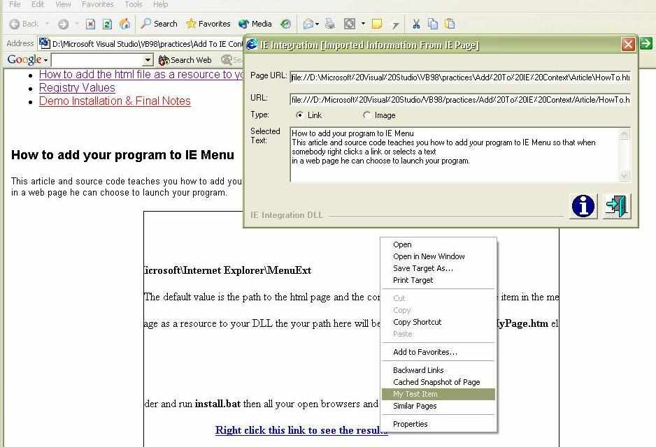



## \_IE Integration DLL

### Description

This source code and article shows how to add your program to IE Menu so that when somebody right clicks a link or selects a text in a web page he can choose to launch your program. See screenshot to get the idea. Zip file includes a complete article, demo, and also an installer/uninstaller
 
### More Info
 

             |
---                |---
**Submitted On**   |2002-08-01 20:22:38
**By**             |[Behrooz Sangani](https://github.com/Planet-Source-Code/PSCIndex/blob/master/ByAuthor/behrooz-sangani.md)
**Level**          |Intermediate
**User Rating**    |5.0 (120 globes from 24 users)
**Compatibility**  |VB 6\.0
**Category**       |[Libraries](https://github.com/Planet-Source-Code/PSCIndex/blob/master/ByCategory/libraries__1-49.md)
**World**          |[Visual Basic](https://github.com/Planet-Source-Code/PSCIndex/blob/master/ByWorld/visual-basic.md)
**Archive File**   |[\_IE\_Integr113271812002\.zip](https://github.com/Planet-Source-Code/behrooz-sangani-ie-integration-dll__1-37498/archive/master.zip)

